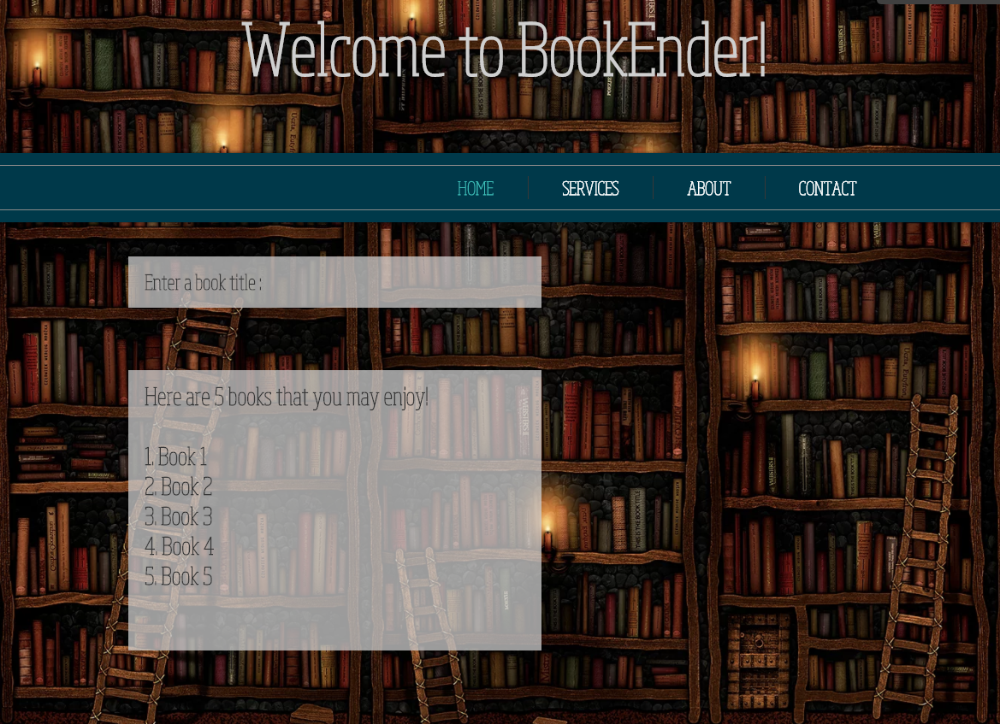

# BookEnder

## Goal  
The goals of this project were:  
* Natural Language Processing (NLP)  
* Topic modeling  
* Unsupervised learning    
* Flask      

## Overview  
For this project I sought to build a book recommender using a dataset of over 16,000 book summaries, collected
and put together by David Bamman and Noah Smith of Carnegie Mellon University.
 
## Data  

The original dataset contained book summaries, genres, authors, and publication dates fo 16,559 books. After
removing null values and summaries that were less than 200 words, the final dataset had 8,825 book entries.

## Model  
 
The basic steps taken to achieve my book recommender is as follows:  

1. **Tokenize words**. I iterated through the summaries and removed stop words and turned every summary
into a list of words.  
2. **Word2Vec**. I used a pre-trained corpus of 3M words from Google's News dataset to run the words through gensim's word2vec
model. This resulted in a vector that was 300 x 1 dimensions for every word in the summary.  
3. **Mean** Took the mean across all 300 dimensions for every word and came out with a final 300 x 1 vector for
every book summary.  
4. **Cosine Similarity**. Compared documents using cosine similarity.

## Discussion  

A user enters in a book title and the function returns the top 5 books that were closely related based off of
book summary.  

For the future I would love to expand on this project and make it more versatile, and turn it into an actual application.
At the moment the recommender only works if you enter in a book title that is in dataset already. I would also
like to add links to purchase the recommended books. 

Here is a mock-up of the website I would like to build for this application in the future:

Please refer to [these slides](Fletcher_VNK.pdf) for a similar (more aesthetically pleasing) overview of my project!