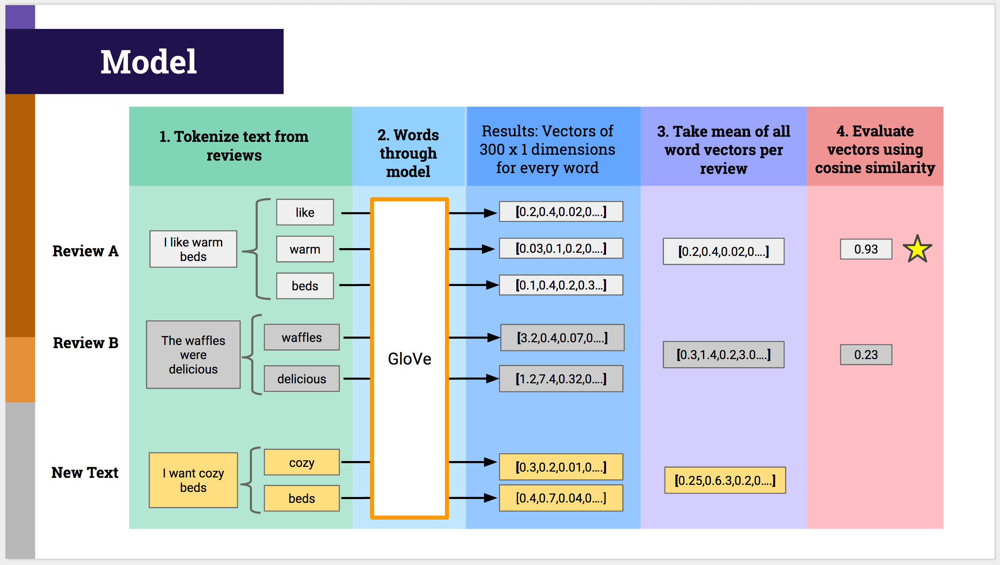

# RecommendAir

## Goal  
The goals of this project were:  
* Natural Language Processing (NLP)  
* Topic modeling  
* Unsupervised learning    

## Overview  
For this project I wanted to address a problem that I often times find myself having when looking through Airbnb listings.
After narrowing down the listings based off of price, location, beds, etc. I finalize my choice by reading through reviews
and choosing the listing that appropriately matches my interests. For example, if I am staying over a week then I usually
am interested in finding a place with a well-equipped kitchen. I usually have to read through hundreds of reviews to learn
what guests say about the kitchen.

This is why I created a recommender for Airbnb listings based off of the user's search query and relative closeness to
reviews for a given listing. 
 
## Data  

I retrieved the data from [Inside Airbnb](http://insideairbnb.com/get-the-data.html), a site that has publicly available 
data on Airbnb hosts, property listings, and reviews for thousands of cities around the world.

## Model  
 
The basic steps taken to achieve the recommender is as follows:  

1. **Tokenize words**. I iterated through the reviews and removed stop words and turned every review
into a list of words.  
2. **Word2Vec**. I used a pre-trained corpus of words from Stanford's GloVe vectors to run the words through gensim's word2vec
model. This resulted in a vectors that were 300 x 1 dimensions for every word in the review.  
3. **Mean** Took the mean across all 300 dimensions for every word and came out with a final 300 x 1 vector for
every book review.    
4. **Cosine Similarity**. Compared reviews and new user text using cosine similarity.  

Here is a visual I made that is a great overview of the process!  

## Discussion  

A user enters in text describing what they are looking for from an Airbnb listing and the recommender pulls up a list of places that have
reviews that most closely relate to what they searched for. title and the function returns the top 5 books that were closely related based off of
book summary.   
